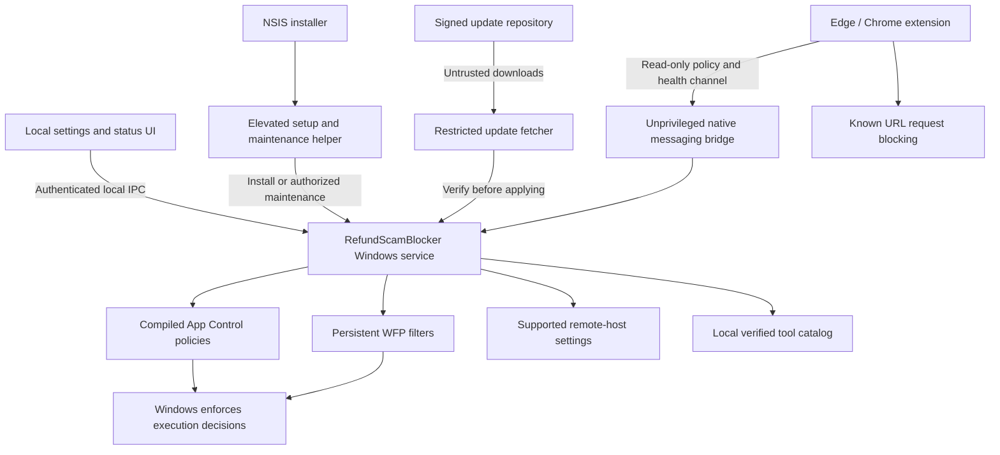

# RefundScamBlocker: researched architecture

Status: proposed design; no protection engine, installer, or blocking rules have been implemented or tested in this repository. Research checked on **2026-09-12**. The decisions below are engineering recommendations based on the linked primary sources, not measured product capabilities. Delivery stages and acceptance criteria are in [IMPLEMENTATION_PLAN.md](IMPLEMENTATION_PLAN.md).

## 1. Recommendation and achievable promise

Build a Windows service that manages **App Control for Business policies to block execution**, **Windows Filtering Platform (WFP) filters to block network connections**, and **browser extensions to block known remote-support download URLs**. Disable or deny identified built-in remote-host features. Distribute the service and a separate settings application in an NSIS installer.

Recommended public description:

> Free, open source Windows software designed to reduce common refund and technical-support scams by blocking known remote-access tools and their connections. A trusted family member can set up password-protected settings and removal. Protection has limits and works best with a standard Windows user account.

There is no universal Windows event meaning “a scammer is requesting remote access.” Legitimate support software uses many protocols, often through encrypted connections initiated by the protected computer. TeamViewer explicitly documents outbound connections and no need to open inbound ports. AnyDesk also works on ordinary web ports. Therefore an inbound firewall, port-3389 block, or download-folder watcher alone is insufficient. [TeamViewer networking][teamviewer], [AnyDesk networking][anydesk-network].

Two absolute requirements need bounded interpretations:

- **Every download/install/session:** known-tool controls can cover a tested catalog. Unknown software, modified open-source tools, arbitrary relays, encrypted archives, and features inside allowed browsers cannot all be classified by purpose. Strict application allowlisting substantially narrows execution but changes how the computer can be used. It still does not identify every scam in an allowed application.
- **Password-only removal and unstoppable restart:** the supported product removal/settings paths can require a password. An elevated Windows administrator, SYSTEM-level attacker, or person controlling the operating system can ultimately bypass an ordinary service. The product must offer an understandable owner recovery path. Windows service permissions explicitly distinguish ordinary users from administrators. [Service access rights][service-access].

The best consumer compromise is a maintained, conservative known-tool blocking mode, with an optional stricter mode developed later. Do not advertise either as blocking “all remote access.” CISA's guidance on abuse of legitimate remote management tools supports combining application control, network restrictions, and monitoring. [CISA advisory][cisa-rmm].

## 2. Requirements and their implementation boundaries

| Request | Proposed implementation | Qualification / evidence required |
| --- | --- | --- |
| A: NSIS installation | Maintained NSIS 3.x Unicode installer invoking a dedicated setup helper | Keep NSIS; it meets the packaging needs. See section 9. |
| B/C: suitable language(s) | C#/.NET 10 for service, policy management, setup and WPF UI; TypeScript for browser extension; NSIS script for packaging | Native Win32 interop is isolated. No custom kernel driver in v1. |
| D: Windows only | Initial test target: supported Windows 11 Home and Pro, x64 | ARM64 follows its own validation; no Linux/macOS work. |
| i: silent startup | Automatic SCM-managed service in session 0 | No startup window or required user login. Settings UI is separate. |
| ii: password to uninstall | Password set at installation, verified by privileged maintenance operation | Also requires Windows elevation. Recovery code can reset a forgotten password. Does not defeat OS administrators. |
| iii: block downloads and installs | Known URL blocking plus execution rules for identified binaries/packages; host-specific installer/script restrictions | Download, install and execution are separate outcomes. Some scripts still run with restrictions; USB, archives, alternate browsers and unknown code bypass download controls. |
| iv: deny remote access after bypass | Persistent inbound/outbound WFP rules, built-in host restrictions, known active-process containment | Unknown software/allowed browsers remain a gap in standard mode; detection after launch is not prevention. |
| v: restart after Task Manager closure | SCM recovery after service process termination; GUI closure leaves service running | Successful administrator stop/disable is not a crash and need not trigger recovery. |

### Supported environment

Develop first against **Windows 11 25H2 Home and Pro x64**. Include 24H2 only while its edition remains supported; Home/Pro 24H2 reaches end of support on 2026-10-13, so it should not become the long-term baseline. New Windows releases require the same tests before being advertised as supported. [Windows lifecycle][windows-lifecycle].

App Control enforcement is available on Home; its PowerShell authoring cmdlets are not. Compile catalog policies on a Windows Pro build/test machine and deploy the resulting artifacts to Home. AppLocker also now works across current editions, so an Enterprise-only assumption must not drive the design. No Intune subscription, domain join, or Microsoft account is required for the native engine. [Feature availability][availability].

Initial exclusions: Windows 10 and older; Windows Server; Windows S mode; ARM64 until validated; organization-managed machines whose application/browser/network policies may conflict. Detect management and existing policies during setup and explain incompatibility instead of replacing them. Windows 10 support would be a separately funded compatibility decision, not implied by API availability.

## 3. Threat model and product boundaries

The primary scenario is a caller persuading a person to download a legitimate remote-support tool, run a portable copy, enter a support code, or enable a built-in help feature. Assume the daily account is a standard user, a trusted owner/caregiver holds a separate Windows administrator credential and the product password, and Windows itself is healthy and maintained.

Protect these assets: prevention of unauthorized screen/control sessions through covered tools; the integrity of active rules, binaries and maintenance credentials; continued ordinary computer use; an owner’s ability to recover or remove the product.

Treat local user processes, web pages, extensions, downloaded files, rules from the network, IPC input, and setup command-line arguments as untrusted. Remote tools are legitimate software being restricted by household policy; their inclusion is not an allegation that a vendor is malicious.

Out of scope for a v1 prevention claim:

- Elevated administrator/SYSTEM compromise, kernel exploits, offline disk modification, OS reinstallation, or bypass through a separate device.
- A person disclosing the administrator/product/recovery credentials to the caller.
- Every feature of an allowed meeting, browser, scripting or accessibility application; fraud by phone or web forms alone; preventing someone photographing the screen.
- Retrospective protection before installation or before newly discovered software is identified and contained.

Installation must be consent-based and visible in Installed apps and Services. Silent normal operation does not mean hiding processes, impersonating Windows, collecting screen contents, or making owner recovery intentionally difficult. No account or cloud control service is needed. Initial versions have no remote “disable protection” endpoint.

## 4. Mechanism comparison

| Mechanism | Strength | Limit / decision |
| --- | --- | --- |
| App Control for Business | Windows enforces code policy before covered code runs; supports signed identities and packaged applications | Main execution boundary. Policy authoring and recovery need careful testing. |
| AppLocker | Useful per-user rules; current Windows editions support enforcement | Consider only for a demonstrated compatibility need. Avoid maintaining two overlapping engines initially; Microsoft prefers App Control. [Microsoft comparison][appcontrol-recommendation] |
| WFP ALE filters | Kernel-enforced application/network decisions through a user-mode management API | Main network layer. Ordinary rules need no custom driver; executable path is not a verified signer or universal remote-access classifier. [Filter API][wfp-api], [ALE][ale] |
| Windows Firewall application rules | Simpler alternative for known paths/services | Useful feasibility comparison; choose one owned network backend rather than duplicating every WFP rule. Neither supplies universal HTTPS content classification. |
| Browser extension / supported policies | Block known URLs before ordinary requests, provide an understandable block page | Browser/profile/store restrictions; does not cover all downloads or native traffic. |
| DNS or IP blocklist | Cheap supplemental restriction for dedicated endpoints | New domains, shared CDN addresses, cache, DoH, VPNs and self-hosted relays limit coverage. Optional, not the base security boundary. |
| Process/file watcher | Inventory, identify existing tools, produce evidence and initiate containment | A process can act before an event handler kills it; file arrival may occur after execution. Never describe this as race-free blocking. |
| TLS interception | Could inspect some decrypted content | Excluded: trust-root installation, privacy exposure, protocol/pinning incompatibility and substantial attack surface. It would still not solve unknown purpose. |
| Custom process/file/network kernel driver | Could implement additional pre-operation hooks | Deferred until a measured gap justifies signing, review, maintenance and crash risks. It does not solve remote intent classification. |

### Why standard mode and strict mode differ

**Standard mode (v1):** explicit denies for reviewed remote-access identities, aiming to preserve ordinary application use subject to the script/COM compatibility effects below. It prioritizes common scam tools and modest support burden. Unknown tools may run.

**Strict mode (later, explicit owner choice):** allow a curated set of needed applications and deny other code. An audited inventory informs proposals, but software is not automatically trusted merely because it was present during learning. Account for scripts, interpreters, DLL loading, installer brokers, extension/native-messaging hosts, management utilities and vulnerable allowed software. Broad “all Microsoft-signed” or user-writable path exceptions are insufficient. Microsoft documents legitimate applications that can circumvent inadequately designed policies. [Bypass-capable applications][bypass-apps].

Strict mode needs tested handling of new software, updates, accessible owner approval and rollback. General browsers still permit some sharing/cobrowsing; a genuinely fixed-use appliance would need a much smaller set of approved web origins and functionality, with significant usability costs. That is a separate product profile.

## 5. Components and privilege boundaries

| Component | Responsibility | Implementation / trust |
| --- | --- | --- |
| `Core` | Pure rule evaluation, schema, version handling, health state | C# library, no elevation or live machine mutation |
| `Windows` | WFP, SCM, code-policy deployment, ACL and identity adapters | Narrow C# Win32 interop; validated inputs, SafeHandle ownership, explicit error handling |
| `Service` | Coordinate policy, inventory, credential verification, maintenance transactions | Dedicated Windows service; initially LocalSystem for required OS operations, with restricted IPC and bounded work |
| `Setup` | Install, upgrade, restore and remove owned artifacts | Elevated C# helper; fixed operation vocabulary, no arbitrary commands or registry paths from a client |
| `UI` | Password entry, status, recovery and owner settings | WPF, standard privilege for status; elevation for maintenance; no network-facing management |
| `BrowserExtension` / `BrowserBridge` | URL blocking and capability reporting | TypeScript MV3 extension; unprivileged C# bridge; no settings/uninstall authorization |
| `UpdateFetcher` | Fetch bounded metadata/artifacts to staging | Restricted identity/process; the service independently verifies before applying |

C#/.NET 10 LTS reduces memory-management risk in the long-running service and supports native Windows APIs and WPF. Keep unsafe/interop code small and separately reviewed. Publish self-contained binaries; update embedded runtimes as part of security releases. TypeScript is needed only for browser integration, and NSIS for packaging. No Python, Node runtime or development SDK is required on the protected computer. [.NET support][dotnet-support], [Windows service implementation][dotnet-service], [Self-contained publishing][dotnet-publish].

Store binaries beneath the machine Program Files directory. Store machine state beneath `%ProgramData%\RefundScamBlocker`, separating private credentials/journals/staging from sanitized status. Resolve Windows known folders rather than assuming drive letters. Users receive read/execute access only where needed; private state is service/administrator restricted. Quote service paths and resolve helper paths absolutely. Never load DLLs, plugins, scripts or configuration from user-writable search locations.

### Local IPC contract

Use versioned, local-only named pipes with explicit ACLs, bounded messages, timeouts and concurrency limits. Separate status/read-only operations from privileged mutations. Reject remote pipe clients. Validate caller token/SID through Windows impersonation; revert impersonation before performing authorized service work. Defend against pipe squatting and check the server identity. A claimed username, PID, “approved” boolean, or extension message is not authorization. [Named-pipe permissions][pipe-security].

The extension bridge can request the current approved browser rules and submit limited health observations. It cannot add arbitrary rules, run an installer, stop protection, reset credentials or request unrestricted file access. Browser traffic must not become a general-purpose SYSTEM API.

## 6. Enforcement design

### 6.1 Prevent known software from executing

Create one RefundScamBlocker-owned standalone App Control **base deny policy** using the multiple-policy format and stable owned GUIDs. It must include AllowAll entries in both kernel and user-mode scenarios before adding explicit denies. Omitting these entries can implicitly deny everything. Existing base policies retain their restrictions; an RSB AllowAll policy does not override another policy's deny. Do not merge into, overwrite or remove an unrelated policy. Validate release policies in audit mode in the lab before consumer enforcement. [Deny-policy guidance][deny-policy].

Enable user-mode enforcement (`Enabled:UMCI`, option 0). Enable and validate Store-app enforcement (`Required:Enforce Store Applications`, option 12) before claiming package coverage; otherwise mark that coverage unavailable. Prefer narrowly scoped FilePublisher identities. A signed OriginalFileName can survive a disk rename. Never block all Microsoft or Google signatures to block one product. Keep ordinary artifact SHA-256 separate from App Control's image/Authenticode hashes. Test explicit version ranges and certificate rotation. [Rule semantics][policy-rules].

Proposed standard mode retains script enforcement (option 11 absent). Its effects require explicit compatibility tests: disallowed PowerShell can run in ConstrainedLanguage, interactive PowerShell is restricted, and MSHTA/MSXML execution can be blocked even with an audit policy. Batch files and scripts in unenlightened interpreters are not directly controlled. A script “blocked” event alone is not evidence of no execution. Claim only the observed host-specific behavior; a script delivering a denied EXE still encounters the EXE gate. [Script enforcement][script-enforcement].

To limit unrelated breakage, standard mode explicitly allows COM registrations within its owned policy (`AllHostIds` / `AllKeys` / `EnterpriseDefinedClsId` true), preserving other policies' restrictions. COM behavior is independent of option 11, and this allowance does not solve every .NET COM compatibility issue. Test representative COM-dependent apps and disclose incompatibilities before activation. Strict mode needs its own narrower COM review. [COM policy configuration][com-policy].

For unsigned releases use generated code-identity hashes where appropriate, with narrow metadata rules only after false-positive review. A filename or unsigned version string by itself is not reliable identity. Updating or rebuilding an unsigned tool can evade a hash rule; report that gap.

Apply coverage to identified portable EXEs, installed clients/services, helper processes, installers and relevant Store/MSIX packages, with script outcomes qualified above. Do not simply blacklist setup filenames. An MSI broker can install data even when a later executable is denied; an unrecognized installer may also write a covered payload. Record “installed but could not run” separately from “installation prevented.” Preserve the payload execution gate even when delivery classification fails.

Use compiled, release-validated policies on Home. A policy adapter invokes the supported Windows deployment mechanism with trusted artifact paths and owned IDs, reads effective policy state and checks errors/restart requirements. Home must never depend on unavailable local authoring cmdlets. [Deployment][policy-deploy].

Default policies are **unsigned at the App Control tamper-protection layer**; the distribution manifest and release binaries are still cryptographically signed. Signed App Control base policies can bind removal/update to authorized signers with Secure Boot and can cause boot failure if mishandled. They are deferred pending a separate recovery design and extensive validation. [Signed-policy requirements][signed-policy].

### 6.2 Deny known network connections

The service uses `Fwpuclnt.dll` to own a persistent WFP provider, sublayer and filters. Use built-in `FWP_ACTION_BLOCK` actions, configured in transactions. Primary layers are `FWPM_LAYER_ALE_AUTH_CONNECT_V4/V6` and `FWPM_LAYER_ALE_AUTH_RECV_ACCEPT_V4/V6`; cover TCP and UDP and test loopback, LAN, VPN adapters and IPv6. Obtain normalized executable application IDs through the Windows API; use package/service identity only where the selected layer supports it. [WFP overview][wfp], [ALE layers][ale-layers].

A basic WFP application ID is path-based. It does not verify the publisher, inspect TLS content or synchronously ask this C# service to identify every executable. Do not imply it prevents a first connection from every new unknown path. The App Control policy supplies the primary known-code execution gate; network rules add coverage for known installed/running paths and supported host components.

Persist the provider, sublayer and filters in a non-dynamic session; dynamic-session filters would disappear if the service died. If a provider references the service, keep that service Automatic and verify filter reloading at BFE startup. Persistent filters and boot-time filters have different lifetimes: persistence alone does not establish earliest-boot protection. Measure the boot window before making any such claim. [WFP object lifetime][wfp-objects].

Do not globally block ports 80/443, shared cloud IP ranges, `svchost.exe`, browsers, or all UDP. Do not assume maximum filter weight overrides every other security product. Test coexistence with Defender Firewall, IPsec/VPN software and existing providers. No global firewall reset or blanket allow rules.

**Existing sessions:** enumerate running tools and services at install and after catalog updates, verify identity, add path/package blocks, then stop only positively identified blocked components. App Control does not retroactively kill a running tool. ALE policy changes can reauthorize existing flows on subsequent traffic; verify interruption with both TCP and UDP tests. Termination is secondary containment and may follow data exposure. Shared browser/OS host processes must not be killed based solely on a domain or filename match. [ALE reauthorization][reauthorization].

If setup is being performed through a remote-support session, warn before activation and require local completion; otherwise activation may sever the only installation channel. Do not label the installation fully protected while an identified disallowed session remains active.

### 6.3 Download and browser layer

Ship store-published Edge and Chrome Manifest V3 extensions with a reviewed set of known support/download URL rules. Use `declarativeNetRequest` for request-time blocking and an accessible local explanation. Keep permissions minimal and avoid collecting browsing history. DNR has quotas; it covers HTTP-cache responses but not responses synthesized by service workers or retrieved from CacheStorage. Rule activation and update failures must be observable. [DNR API][dnr].

Use `downloads` events only for supplemental cancellation of recognizable downloads. Cancellation is asynchronous and a download may already be complete. A Downloads-folder watcher is likewise discovery, not a universal interception point. No automatic deletion of unrelated files and no unsupported assertion that all bytes were prevented from reaching disk. [Downloads API][downloads].

**Consumer deployment constraints are a release gate:** on unmanaged Windows, force-installing arbitrary self-hosted extensions is restricted. The consumer path needs a Chrome Web Store listing and Edge Add-ons listing, stable extension IDs and a verified policy configuration. Do not require enterprise enrollment simply to conceal this gap. Force-install policy does not itself guarantee Incognito/InPrivate coverage. [Chrome extension policy][chrome-force], [Edge extension policy][edge-force].

Current Edge documentation says `URLBlocklist`, `DownloadRestrictions` and `ScreenCaptureAllowed` do not apply to profiles signed into personal Microsoft accounts. Inspect effective policy and exercise each supported profile instead of trusting a registry write. The URL extension remains a separate mechanism with its own tested permissions and availability. Missing extensions, unsupported/private/guest profiles and alternate browsers must show limited browser coverage. [Edge URL policy][edge-url], [Edge download policy][edge-download], [Edge capture policy][edge-capture].

Built-in dangerous-download blocking is not a remote-support classifier: these are often signed legitimate tools. A broad “block all downloads” option is too disruptive for default use. Requests from email, USB, SMB, package managers, encrypted archives, blob/data URLs and unprotected browsers may evade this layer; extraction or copying does not exempt their executable from App Control.

Do not implement universal domain filtering by taking a DNS answer and blocking the resulting shared IPs. TLS hides application payloads; DoH can hide DNS from a conventional resolver; QUIC uses secure UDP transport. No global DoH/QUIC downgrade in v1. A later optional DNS control must document its scope and bypasses. [TLS specification][tls], [DoH specification][doh], [QUIC specification][quic].

### 6.4 Built-in and browser-based support

Treat Quick Assist, legacy Windows Remote Assistance and the RDP host as separate capabilities. Deny Quick Assist's identified package/executable including reinstallation; disable supported solicited and unsolicited Remote Assistance settings and deny identified host components; disable RDP hosting where present and apply narrowly scoped network protection. RDP client use to another computer is a separate policy decision, not evidence the local host is exposed. Remote Assistance CSP documentation is edition-scoped; Home behavior needs native-setting and execution-rule tests rather than assuming MDM settings work everywhere. [Remote Assistance policy][remote-assistance].

Inventory Remote Help, WinRM and OpenSSH server if present. Offer explicit home-device restrictions for enabled remote administration; refuse conflicting managed deployments. Preserve previous settings for owned rollback. Do not disable all Windows management, networking or accessibility services indiscriminately.

Microsoft documents Quick Assist's dedicated relay endpoint, `remoteassistance.support.services.microsoft.com`, and warns that blocking it also affects Remote Help. Google documents `remotedesktop-pa.googleapis.com` for Chrome Remote Desktop blocking; disabling firewall traversal still leaves LAN/VPN access. These are useful catalog evidence, **not working rules in this repository**, nor justification for blocking entire Microsoft/Google domains. Endpoint enforcement depends on a supported domain-aware layer; basic WFP IP filters cannot safely substitute for it. [Quick Assist][quick-assist], [Chrome Remote Desktop administration][crd-admin].

Browser screen sharing can expose financial information even without a native support installation. `getDisplayMedia` captures screen media following browser consent; it does not itself confer arbitrary Windows mouse/keyboard control. Cobrowsing inside an allowed site is another distinct surface. Browser capture policies can reduce this where supported, but may break meetings and are not universal. New or arbitrary websites remain outside known-URL prevention. [W3C screen capture][screen-capture].

## 7. Service lifecycle, health and failure behavior

Register one clearly named `RefundScamBlocker` service with Automatic startup. UI startup is optional. Configure SCM failure actions with proposed delays of 5, 15 and 60 seconds and a one-day failure-count reset; record repeated faults. Do not reboot the computer as a recovery action. Keep maintenance/OS shutdown clean and distinguish them from fatal errors.

Set non-crash failure recovery deliberately. SCM recovers termination without a normal stopped report, and can recover nonzero stopped results with the failure flag; a successful Stop is not failure. A .NET worker exception must not be converted into an apparently successful shutdown that prevents restart. Use an intentional nonzero fatal exit after bounded cleanup. Test both task termination and worker faults. [SCM failure semantics][failure-actions], [Worker Service guidance][dotnet-service].

Ordinary users may query status but cannot stop/delete/reconfigure the service or modify binaries/private state. A standard user's Task Manager may therefore be unable to terminate it at all. An elevated administrator can still disable or remove it. No mutual watchdog loops, scheduled-task resurrection after authorized removal, service hiding, or PPL assumption: protected antimalware services have specialized ELAM and signing requirements. [Protected-service requirements][ppl].

Health is per component: service, effective execution policy/version, persistent network filters, browser/profile coverage, built-in restrictions, catalog freshness, pending restart and active-session containment. An active process alone is not proof of protection. Normal operation has no recurring popups; the settings/status surface and relevant block explanation show actionable failures without alarming repeated messages.

| Failure | Required behavior |
| --- | --- |
| Service process dies | Existing App Control and persistent WFP enforcement remain; SCM restarts coordinator. Discovery and management may be temporarily unavailable. |
| Browser extension missing/stopped | Retain native protections; report browser coverage limited. Do not falsely report download protection. |
| Invalid/expired update or offline computer | Reject new untrusted metadata; retain last verified rules, report freshness problems and retry with backoff. Do not silently disable rules or cut off all internet access. |
| App Control deployment fails | Keep previous policy; initial installation cannot claim normal protection. Explain failure and restore owned changes if setup is abandoned. |
| BFE/network backend unavailable | Preserve code policy; mark network protection failed. Do not claim every session is denied or repeatedly alter unrelated system settings. |
| Partial update/removal or power loss | Resume or roll back from a durable journal; keep recovery tooling until pending policy removal is complete. |
| Repeated crashes / corrupted credential state | Maintain OS rules where possible and expose repair/recovery; no automatic credential reset or “allow all” fallback. |

## 8. Passwords, owner recovery and maintenance

The installation helper opens a trusted local password UI. Require confirmation and encourage a long unique passphrase; do not reuse the Windows password. Keep password material out of NSIS variables where possible, command lines, environment variables, installer logs, telemetry and crash dumps. Transmit only through authenticated local IPC or retain it in the trusted verifier process. Managed-memory handling cannot promise perfect erasure; minimize lifetime and zero buffers under direct control.

Store a versioned salted **Argon2id verifier** using a reviewed library. Proposed initial parameters: 64 MiB, three iterations, one lane, a random 16-byte salt and a 32-byte result; benchmark for acceptable latency on low-end supported devices. Do not go below the then-current OWASP minimum. Use constant-time comparison and bounded resource use. Rate-limit attempts with persistent backoff, capped at a recoverable delay, rather than permanent lockout. DPAPI may additionally protect state but is not a replacement for hashing or ACLs. [OWASP password guidance][passwords].

Generate a separate cryptographically random recovery code with at least 128 bits of entropy, display it once for external storage, and store only its verifier. Require Windows elevation to use it, then reset the password and rotate the recovery code. No master password, security questions, public bypass code or maintainer recovery secret. Explain this recovery exception during setup. If both secrets are lost, the owner may still use a separately documented Windows-administrator recovery procedure; it exercises OS authority outside the normal product endpoints and password boundary. It is not a password-free mode in the installer or an empty-password fallback.

Every supported operation that weakens protection requires authenticated owner maintenance: password changes, disabling rules, adding exceptions, stopping the service for maintenance and uninstalling. Verify authorization inside the privileged operation, not just the UI. Use a short-lived, one-use, operation-specific authorization bound to the caller and installation; no reusable “unlocked” file. Reinstall, repair, old installers, alternate uninstaller entry points and silent `/S` must not reset or bypass credentials.

If the service is unavailable, a protected elevated maintenance helper may validate the same credential record and apply the same lockout rules under an exclusive maintenance lock. Missing/corrupt credentials trigger explicit recovery, never acceptance of an empty password. Automatic signed upgrades can preserve protection without prompting for the password, but cannot reset credentials, request arbitrary execution, or install an older vulnerable version.

Keep v1 simple: no one-click temporary remote-support exception. If added later, it must be password-authorized, product-scoped, time-limited and survive crash/reboot safely. A broad network allow rule cannot override an App Control deny; any exception needs a coordinated policy change with verified expiry and compatible activation semantics.

## 9. Installer, updates and removal

### Installer decision

**Retain NSIS.** The official project lists NSIS 3.12, released April 19, 2026; age alone is not evidence of abandonment. It supports the required elevated machine installation and custom workflows. Use a small script and first-party setup helper instead of obscure password/service plugins. [NSIS releases][nsis], [NSIS scripting][nsis-manual].

| Alternative | Evaluation |
| --- | --- |
| WiX / MSI | Better native Windows Installer transaction and enterprise deployment integration. Custom WFP/code-policy changes still need explicit rollback. No inherent password security advantage. Revisit for enterprise packaging. [MSI rollback][msi-rollback] |
| MSIX | Supports some services on modern Windows; do not dismiss it as service-incompatible. Its package-managed lifecycle and service constraints are a less direct fit for this product's custom maintenance/removal flow. [MSIX services][msix-services] |
| NSIS + setup helper | Chosen: consumer EXE, predictable offline payloads, custom local credential flow; team owns journaling, repair and integration testing. |

### Installation transaction

1. Verify OS/architecture, elevation, disk space, required APIs/services, existing RSB state, active remote sessions and management/policy conflicts. Use native 64-bit registry/file-system access on x64.
2. Present protection scope, expected interruptions, browser limitations and owner recovery. Collect/confirm credentials through the trusted helper. Register initial provisioning once; re-running setup cannot initialize a second password.
3. Stage verified signed payloads in a protected directory. Capture prior values and owned-object IDs in a durable, versioned journal **before** each mutation. Use idempotent steps with explicit return codes.
4. Register service, ACLs, native messaging host and recovery configuration. Install validated execution/network rules and selected built-in restrictions. Browser store installation may require connectivity and time; report that state separately.
5. Verify effective OS policies and run a benign enforcement probe. Contain covered preexisting sessions. Complete only after mandatory checks pass, or clearly report limited coverage/pending restart. Never silently activate an untested strict allowlist.
6. On cancellation/failure, restore only this transaction's owned changes. Preserve a resumable recovery path across process termination, locked files and power loss. NSIS by itself is not an atomic transaction for Windows security policy.

### Updates and rule distribution

Ship an embedded, verified starting catalog so native protection works offline. Retrieve metadata on a proposed six-hour jittered schedule with capped backoff; this is a design target, not an existing service. Use a maintained update framework implementing signed role-separated metadata, target hashes/lengths, expiry and rollback/freeze resistance. The Update Framework describes these properties; choose a maintained implementation after verifying .NET integration rather than claiming a custom JSON signature achieves all of them. [TUF metadata][tuf], [TUF specification][tuf-spec].

Separate release-binary signing, catalog/update signing, and optional future App Control tamper-policy signing. Protect offline root/recovery keys; use protected release workflows and independently reviewed changes. Public verification keys ship with the application. There are no signing secrets in the repository or installed client.

Validate size, schema, source trust, hashes, versions and compatibility before a privileged apply. Rules are data, never executable scripts or arbitrary registry instructions. Stage and check a complete generation, apply per-backend transactions, then reconcile the cross-backend result with the journal. No global transaction spans WFP, code policies and browsers. Preserve existing enforcement until a replacement is effective. Roll back to previously trusted compatible artifacts on failed health checks without accepting a network-supplied downgrade; record the failed generation and avoid retry loops. Keep persistent filters installed during binary upgrades.

### Supported uninstall and recovery

Installed apps and direct NSIS uninstall both invoke the authenticated maintenance flow. An NSIS `un.onInit` rejection is useful UI plumbing, but the privileged helper must also enforce authorization. Silent removal without a secure preauthorized transaction fails; do not accept a password command-line switch. [NSIS uninstall callback][nsis-uninstall].

Stop update/reconciliation work, deactivate/remove only owned code-policy IDs, remove owned WFP filters before their sublayer/provider, and restore owned browser/host settings conditionally. Restore a previous value only if its current value still matches what RSB applied; otherwise report the conflict and preserve the newer external setting. Browser lists require entry-level ownership. Never clear entire policy stores or reset the global firewall.

On Windows 11 24H2 and newer, unsigned App Control policies can be removed using CiTool without a restart; still verify actual removal and honor any other pending restart. Keep the helper/journal until cleanup is confirmed. Do not blindly delete active signed policy files: their removal requires a specific signed replacement and reboot sequence, another reason signed base-policy tamper resistance is deferred. [Microsoft policy removal][policy-removal].

Document an offline owner recovery runbook before any public release, including installation-specific policy IDs, local verification, backup/recovery prerequisites and support for interrupted maintenance. Recovery tooling must never delete another product's policy. Do not turn off Secure Boot/antivirus or weaken OS protections as a normal installation requirement.

## 10. Catalog, privacy and operational costs

Each rule record needs a stable ID, product/component, policy action, confidence, exact identity fields, tested version range/architecture, artifact source, observed date, review deadline, source/license provenance, rationale, negative-control tests and rollback reference. Keep `artifactSha256` separate from `appControlImageHashes`; derive both from actual files. URL rules specify exact host/path scope and redirect behavior, with a justification for shared-service impact. Never populate hashes or signer IDs from guesses.

The initial research candidates are **not an implemented blocklist**:

| Candidate family | Why the test matters | Evidence |
| --- | --- | --- |
| AnyDesk portable + service | No installer/admin needed for portable use; ordinary web-port fallback | [Portable modes][anydesk-portable], [Networking][anydesk-network] |
| TeamViewer QuickSupport / Host / full client | Outbound relay, fallback and direct sessions | [Vendor networking][teamviewer] |
| RustDesk public / self-hosted / custom build | Arbitrary signaling/relay domains and direct connections | [Self-hosting][rustdesk] |
| Quick Assist / Remote Help | Windows/Store identity, relay service, reinstallation | [Microsoft guidance][quick-assist] |
| Chrome Remote Desktop | Native host plus browser entry point, direct/STUN/TURN | [Google network guide][crd-network] |
| Splashtop SOS / Streamer | Cloud outbound 443 and direct LAN | [Vendor network guide][splashtop] |
| Zoho Assist / Cobrowse | Native remote control and browser-only assistance are distinct | [Vendor firewall guide][zoho] |
| ScreenConnect, RemotePC, GoTo/LogMeIn/Rescue, BeyondTrust, VNC variants, DWService, MeshCentral | Additional discovery/test backlog; obtain vendor evidence and identities before claiming coverage | Unresearched candidate entries, not shipped rules |
| RDP, legacy Remote Assistance, OpenSSH server, WinRM | Built-in or optional host capabilities can exist without new downloads | Edition-specific lab validation required |

Events should contain time, component, catalog/rule ID, action/outcome, version and a minimally identifying product name. Separate “request blocked,” “execution blocked,” “session interrupted” and “discovered after launch.” Avoid passwords, recovery material, screen captures, keystrokes, browser history, full query strings or full user file paths by default. Keep local logs bounded, proposed 30 days/20 MiB whichever comes first. Diagnostic export is explicit and redacted; telemetry is off by default.

“Free and open source” does not eliminate operating costs: maintainers need Windows test environments, release signing, extension-store distribution, update hosting, security maintenance and response to false positives. Preserve the existing Apache-2.0 license. Account for third-party licenses, notices and SBOMs; do not redistribute proprietary remote-support installers as test fixtures without permission. No paid cloud dependency for core local protection.

## 11. Source notes

The sources linked throughout this document are primary vendor, standards, government or project documentation, checked for this design on 2026-09-12. Specific platform support and policy behavior must be rechecked at release time. The implementation decisions and proposed timing/resource targets are ours; the sources do not certify this product.

[teamviewer]: https://www.teamviewer.com/en-us/global/support/knowledge-base/teamviewer-remote/troubleshooting/ports-used-by-teamviewer/
[anydesk-network]: https://support.anydesk.com/firewall
[anydesk-portable]: https://support.anydesk.com/portable-vs-installed
[service-access]: https://learn.microsoft.com/en-us/windows/win32/services/service-security-and-access-rights
[cisa-rmm]: https://www.cisa.gov/sites/default/files/2023-02/aa23-025a-protecting-against-malicious-use-of-rmm-software.pdf
[windows-lifecycle]: https://learn.microsoft.com/en-us/lifecycle/products/windows-11-home-and-pro
[availability]: https://learn.microsoft.com/en-us/windows/security/application-security/application-control/app-control-for-business/feature-availability
[appcontrol-recommendation]: https://learn.microsoft.com/en-us/powershell/scripting/security/app-control/application-control?view=powershell-7.6
[wfp-api]: https://learn.microsoft.com/en-us/windows/win32/api/fwpmu/nf-fwpmu-fwpmfilteradd0
[ale]: https://learn.microsoft.com/en-us/windows/win32/fwp/application-layer-enforcement--ale-
[bypass-apps]: https://learn.microsoft.com/en-us/windows/security/application-security/application-control/app-control-for-business/design/applications-that-can-bypass-appcontrol
[dotnet-support]: https://dotnet.microsoft.com/en-us/platform/support/policy
[dotnet-service]: https://learn.microsoft.com/en-us/dotnet/core/extensions/windows-service
[dotnet-publish]: https://learn.microsoft.com/en-us/dotnet/core/deploying/
[pipe-security]: https://learn.microsoft.com/en-us/windows/win32/ipc/named-pipe-security-and-access-rights
[deny-policy]: https://learn.microsoft.com/en-us/windows/security/application-security/application-control/app-control-for-business/design/create-appcontrol-deny-policy
[policy-rules]: https://learn.microsoft.com/en-us/windows/security/application-security/application-control/app-control-for-business/design/select-types-of-rules-to-create
[script-enforcement]: https://learn.microsoft.com/en-us/windows/security/application-security/application-control/app-control-for-business/design/script-enforcement
[com-policy]: https://learn.microsoft.com/en-us/windows/security/application-security/application-control/app-control-for-business/design/allow-com-object-registration-in-appcontrol-policy
[policy-deploy]: https://learn.microsoft.com/en-us/windows/security/application-security/application-control/app-control-for-business/deployment/deploy-appcontrol-policies-with-script
[signed-policy]: https://learn.microsoft.com/en-us/windows/security/application-security/application-control/app-control-for-business/deployment/use-signed-policies-to-protect-appcontrol-against-tampering
[wfp]: https://learn.microsoft.com/en-us/windows/win32/fwp/about-windows-filtering-platform
[ale-layers]: https://learn.microsoft.com/en-us/windows/win32/fwp/ale-layers
[wfp-objects]: https://learn.microsoft.com/en-us/windows/win32/fwp/object-management
[reauthorization]: https://learn.microsoft.com/en-us/windows/win32/fwp/ale-re-authorization
[dnr]: https://developer.chrome.com/docs/extensions/reference/api/declarativeNetRequest
[downloads]: https://developer.chrome.com/docs/extensions/reference/api/downloads
[chrome-force]: https://chromeenterprise.google/policies/extension-install-forcelist/
[edge-force]: https://learn.microsoft.com/en-us/deployedge/microsoft-edge-policies/ExtensionInstallForcelist
[edge-url]: https://learn.microsoft.com/en-us/deployedge/microsoft-edge-policies/URLBlocklist
[edge-download]: https://learn.microsoft.com/en-us/deployedge/microsoft-edge-policies/DownloadRestrictions
[edge-capture]: https://learn.microsoft.com/en-us/deployedge/microsoft-edge-policies/ScreenCaptureAllowed
[tls]: https://www.rfc-editor.org/info/rfc8446/
[doh]: https://www.rfc-editor.org/info/rfc8484/
[quic]: https://www.rfc-editor.org/info/rfc9000/
[remote-assistance]: https://learn.microsoft.com/en-us/windows/client-management/mdm/policy-csp-remoteassistance
[quick-assist]: https://learn.microsoft.com/en-us/windows/client-management/client-tools/quick-assist
[crd-admin]: https://support.google.com/chrome/a/answer/2799701?hl=en
[screen-capture]: https://www.w3.org/TR/screen-capture/
[failure-actions]: https://learn.microsoft.com/en-us/windows/win32/api/winsvc/ns-winsvc-service_failure_actions_flag
[ppl]: https://learn.microsoft.com/en-us/windows/win32/services/protecting-anti-malware-services-
[passwords]: https://cheatsheetseries.owasp.org/cheatsheets/Password_Storage_Cheat_Sheet.html
[nsis]: https://nsis.sourceforge.io/Download
[nsis-manual]: https://nsis.sourceforge.io/Docs/Chapter4.html
[msi-rollback]: https://learn.microsoft.com/en-us/windows/win32/msi/rollback-installation
[msix-services]: https://learn.microsoft.com/en-us/windows/msix/packaging-tool/convert-an-installer-with-services
[tuf]: https://theupdateframework.io/docs/metadata/
[tuf-spec]: https://theupdateframework.github.io/specification/v1.0.28/
[nsis-uninstall]: https://nsis.sourceforge.io/Reference/un.onInit
[policy-removal]: https://learn.microsoft.com/en-us/windows/security/application-security/application-control/app-control-for-business/deployment/disable-appcontrol-policies
[rustdesk]: https://rustdesk.com/docs/en/self-host/
[crd-network]: https://support.google.com/chrome/a/answer/16364503?hl=en
[splashtop]: https://support-splashtopbusiness.splashtop.com/hc/en-us/articles/115001811966-What-Are-the-Firewall-Exceptions-and-IP-addresses-of-Splashtop-Servers-Services
[zoho]: https://www.zoho.com/assist/help/troubleshooting/firewall-configuration.html
